# pla1.pqtm19.local
## Introducción
Este archivo contiene la explicación para configurar un entorno de desarrollo para una aplicación Web. Para ello hay que instalar un servidor virtual con el programa XAMPP, un editor de texto IDE (Eclipse en este caso), el Runtime Service de Java para que Eclipse pueda funcionar y una vez se haya creado el repositorio de un proyecto en Eclipse, se subirá a GitHub.

## Índice
1. Instalación XAMPP
2. Configuración de VirtualHost de Apache
3. Definición de Workspace
4. Definición de proyecto
5. Definición de repositorio local
6. Creación de repositorio de GitHub
7. Exportación de la rama "máster" local sobre el repositorio GitHub
## 1. Instalación XAMPP

El objetivo es instalar un servidor HTTP en un entorno local. Para comprobar si existe alguno ya instalado en el equipo, hay que abrir el explorador y escribir http://localhost. En caso de error, no existe ninguno y se puede instalar el paquete XAMMP, que se descarga desde la URL https://www.apachefriends.org/es/index.html. 

Tras descargarlo, doble clic para iniciar la instalación, aparece una ventana de aviso >ok >comienza el asistente de instalación > next > seleccionar Apache y MySQL, PHP y phpMyAdmin > next > ok (a menos que se quiera cambiar la carpeta de destino) > next (pantalla de enlace a Bitnami con información sobre sus productos > next y comienza la copia de archivos. Aparece un mensaje del cortafuegos de Windows, seleccionar redes privadas y deseleccionar las públicas > finish y se abre el panel de control. 

 Al abrir hay que seleccionar el idioma y aparece el panel de control. Hay que cerrarlo desde quit y volver a abrirlo como administrador, seleccionar Apache y MySQL y clic en start para encender Apache.Tanto MySQL como Apache aparecen en verde.  

 Para comprobar que la instalación se ha hecho correctamente, entrar en el navegador como http://localhost. Aparece una página de XAMPP. Para que se encienda automáticamente, ir al panel de configuración y seleccionar Start control.  
	
	

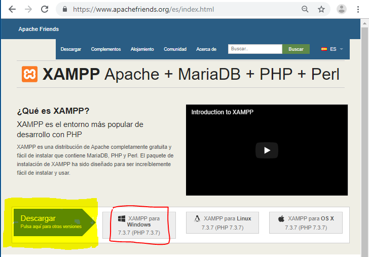

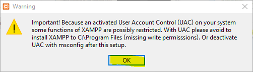
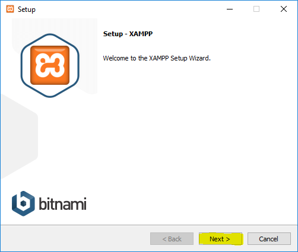
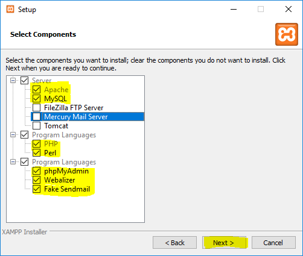

## 2. Configuración de VirtualHost de Apache
 
 Después de instalar Notepad++, editamos el archivo  http.vhosts.conf siguiendo la ruta:

 C:\xampp\apache\conf\extra\http.vhosts.conf

~~~
############### pla1.pqtm19.local ####################
<VirtualHost *:80>

ServerAdmin webmaster@pla1.pqtm19.local
DocumentRoot "C:/PQTM19/Projectes/pla1.pqtm19.local"
ServerName pla1.pqtm19.local
ErrorLog "logs/pla1.pqtm19.local.log"
CustomLog "logs/pla1.pqtm19.local-access.log" common
<Directory "C:/PQTM19/Projectes/pla1.pqtm19.local">
	DirectoryIndex index.php index.html index.htm
	Options Indexes FollowSymlinks Includes ExecCGI
	AllowOverride All
	Order allow,deny
	Allow from all
	Require all granted
</Directory>
	
</VirtualHost>
~~~
A continuación editamos el archivo hosts abriendo el Notepad++ en modo administrador:
C:\Windows\System32\drivers\etc\hosts

Añadimos la línea 127.0.0.1 pla1.pqtm19.local

Y creamos el directorio: C:\PQTM19\Projectes\pla1.pqtm19.local

Apagamos y encendemos Apache.

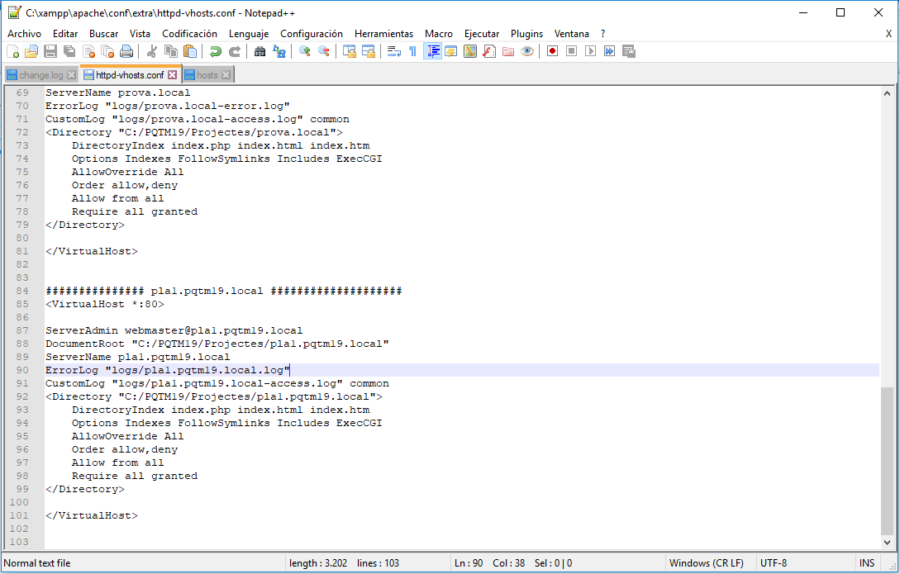
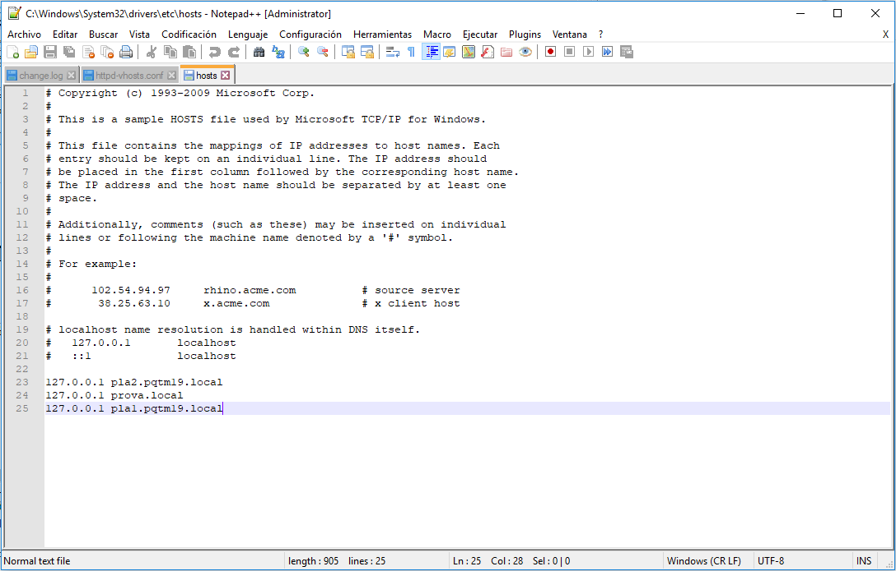
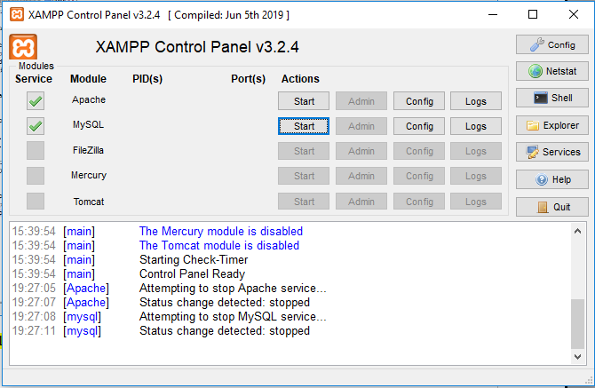
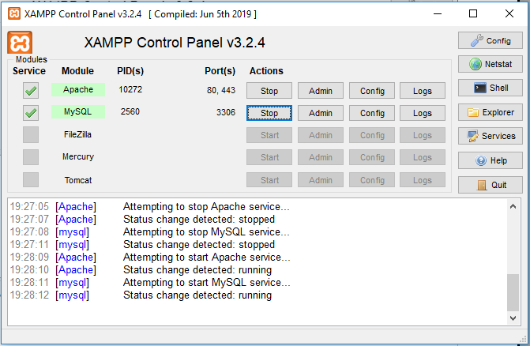

## 3. Instalación de Eclipse

El editor de texto ECLIPSE se descarga desde la página de Eclipse Foundation: https://www.eclipse.org/downloads/

Pero para poder instalar Eclipse es necesario instalar previamente el  Java Development Kit (JDK) o el Java Runtime Environment (JRE) desde la web: (https://www.oracle.com/technetwork/java/javase/downloads/jdk12-downloads-5295953.html) o 

Instalamos Eclipse IDE for PHP Developers.  Click derecho>ejecutar como administrador>seleccionar la carpeta donde se instalará: C:\PQTM19\eclipse\. Dejamos seleccionadas las opciones que vienen por defecto create start menu entry y create desktop shortcut. 
  
  
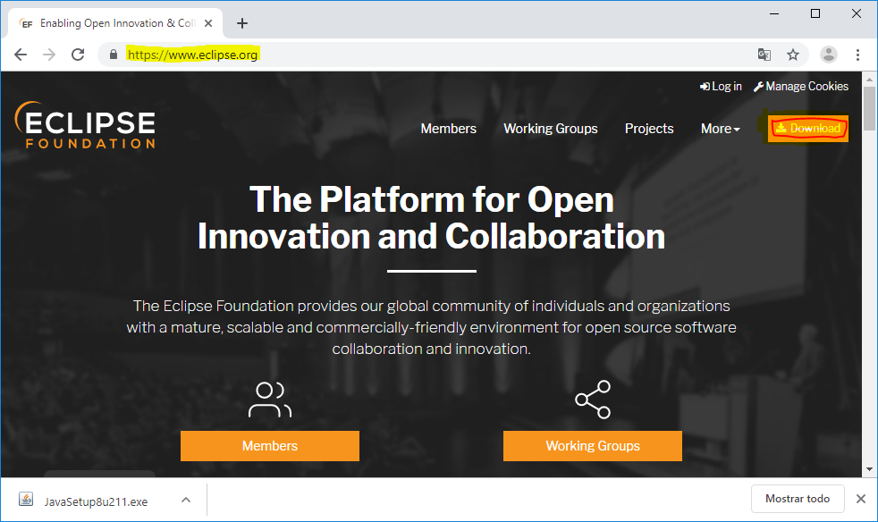  
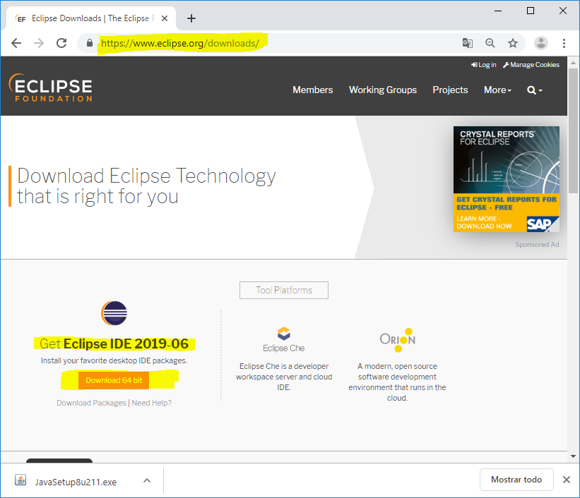  
  
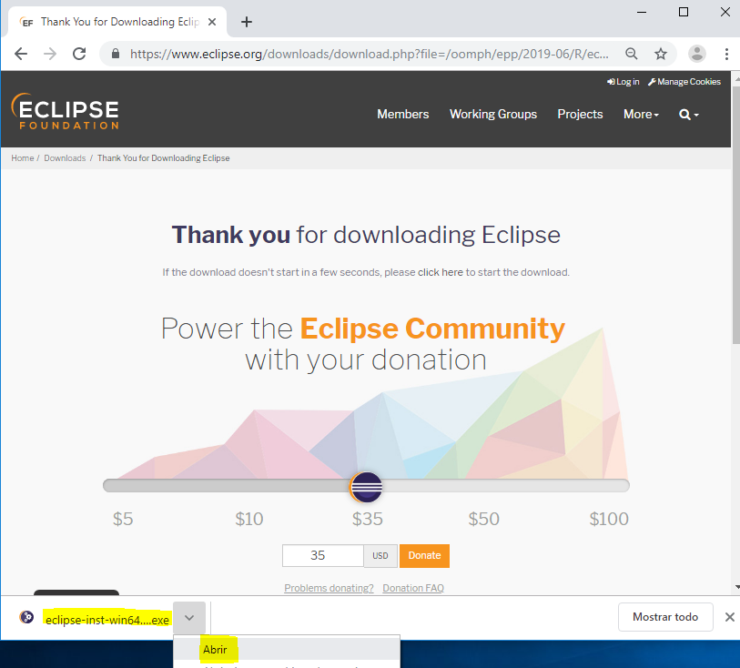  
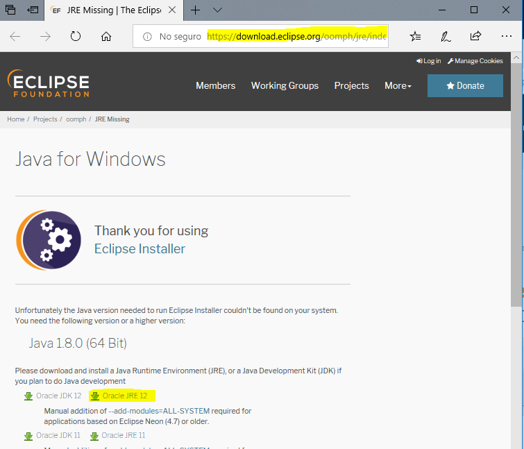  
  
  
  
  
  
  
  
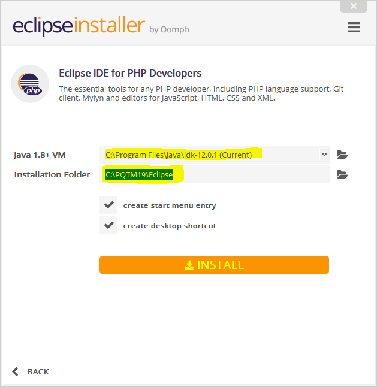  
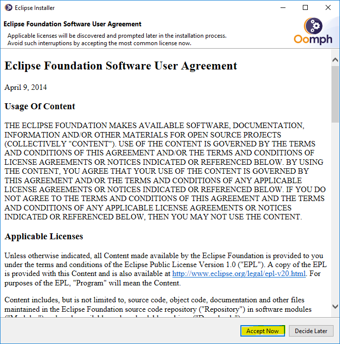  
  
  
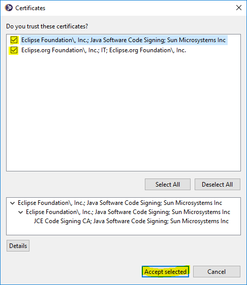  
  
  
 

 
  
## 4. Definición de Workspace
El workspace es la carpeta donde se guardarán todos los archivos que se generen en un proyecto de Eclipse. En cuanto se abre el programa, aparece una ventana donde nos pide seleccionar este directorio. El nuestro será C:\PQTM19\Projectes 

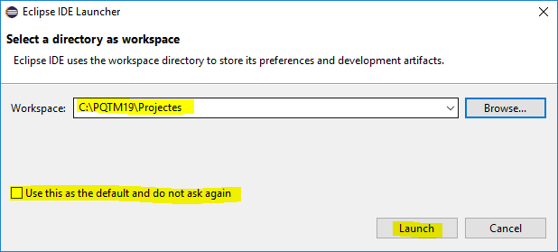 

## 5. Definición de proyecto

file > new > PHP project > create a PHP project > project name: pla1.pqtm19.local > next>next>finish
  
  
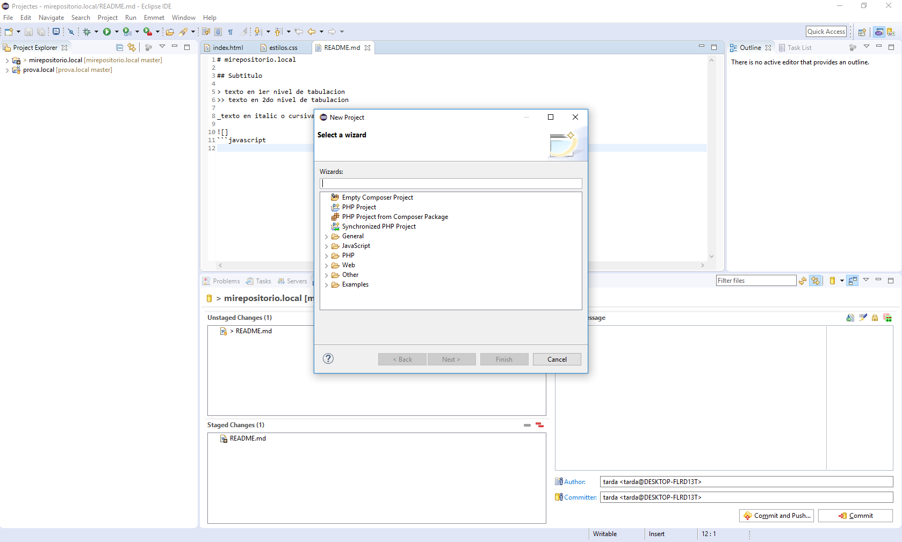  
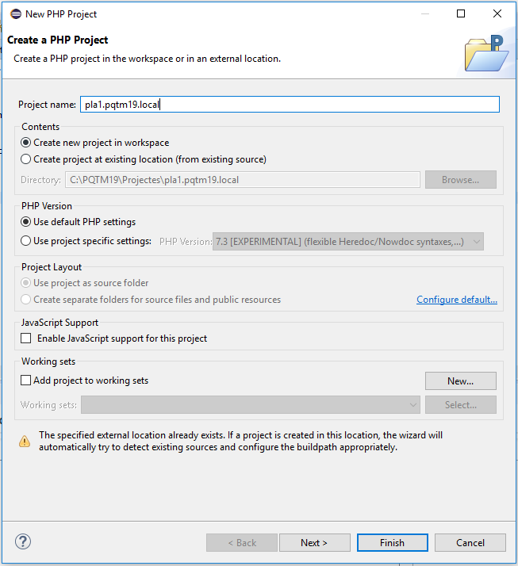 
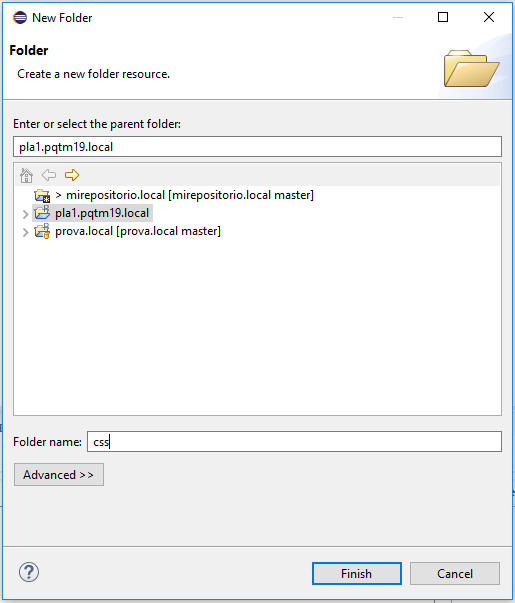 
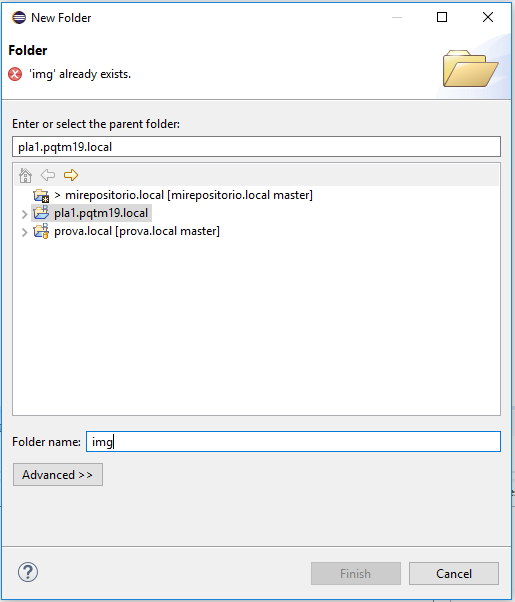 
 
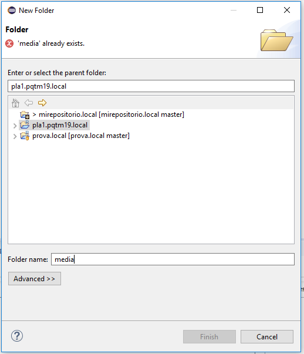 
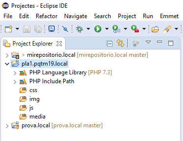 
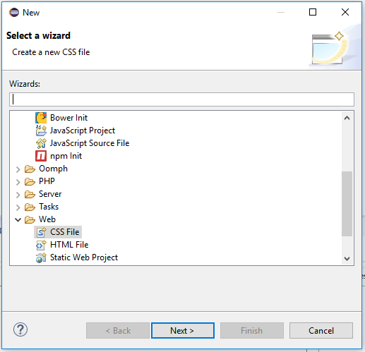 
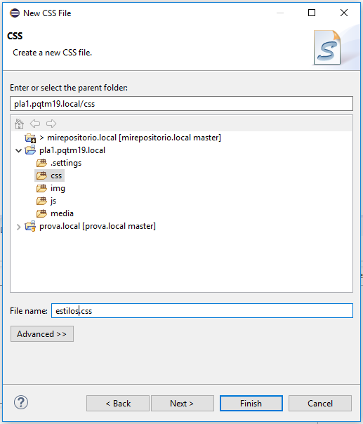 
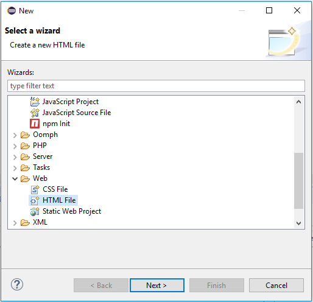 
 
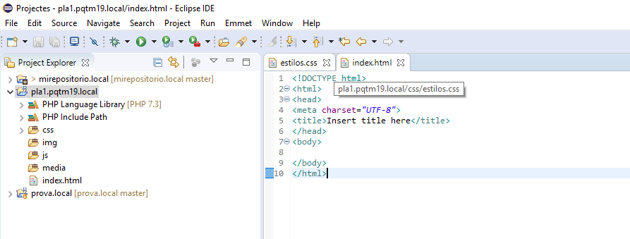 

  
  
## 6. Definición de repositorio local

  Para crear un directorio en el proyecto, menú contextual sobre la carpeta del proyecto y creamos un archivo index.html y cuatro carpetas: css, img, js, media
***pla1.pqtm19.local > new > folder
*** pla1.pqtm19.local > new > other>file>web>HTML File>index.html***

 Creamos un archivo dentro de cada carpeta:
  
-css: menú contextual>new>other>web>css file > next> file name: estilos.css

-js: menú contextual>new>other>javascript> javascript source file: file.js

-img: colocamos en la carpeta las imágenes de la interfaz del proyecto (logotipos, etc.)

-media: incorporamos las imágenes para ilustrar los procesos de instalación, no corresponden a la interfaz

## 7. Creación de repositorio de GitHub

En perspectiva Git: clic en el icono Create a new Git Repositor and add it to this view (menú izquierdo) > abrir la ventana y clic en browse > ir a C:\PQTM19\Projectes\pla1.pqtm9.local> create

 En perspectiva PHP, clic derecho sobre pla1.pqtm19.local [pla1.pqtm19.localmaster]>team>commit.

 Se abre la ventana Git Staging en la parte inferior de la pantalla. En la casilla Unstaged changes se muestran los archivos del proyecto. Hay que ignorar todos los archivos que empiecen . o contienen .settings y pasar el resto a la casilla staged changes con el icono de suma. Para ignorar archivos, seleccionarlos, clic derecho, ignore>ignore.

Después de crear un usuario en github (https://github.com/github), clic en New: repository name: “pla1.pqtm19.local”, private, initialize this repository with a README, create repository. En este caso no hace falta crear un archivo README.md puesto que estamos creando el repository local que después subiremos a GitHub y el readme de este machacaría el creado en GitHub. Por tanto, el readme lo hacemos posteriormente una vez hayamos subido el repositorio desde Eclipse. 

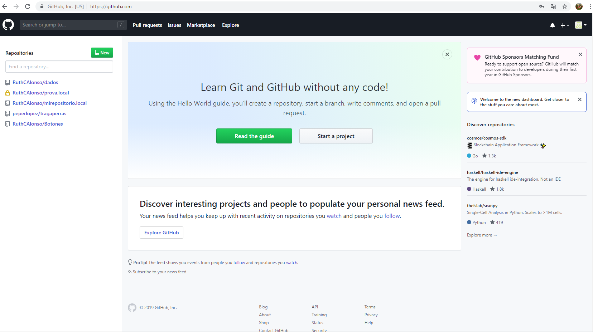
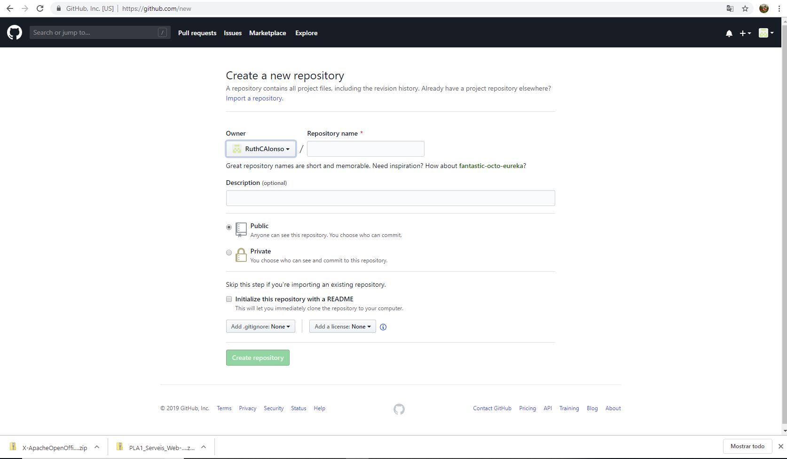

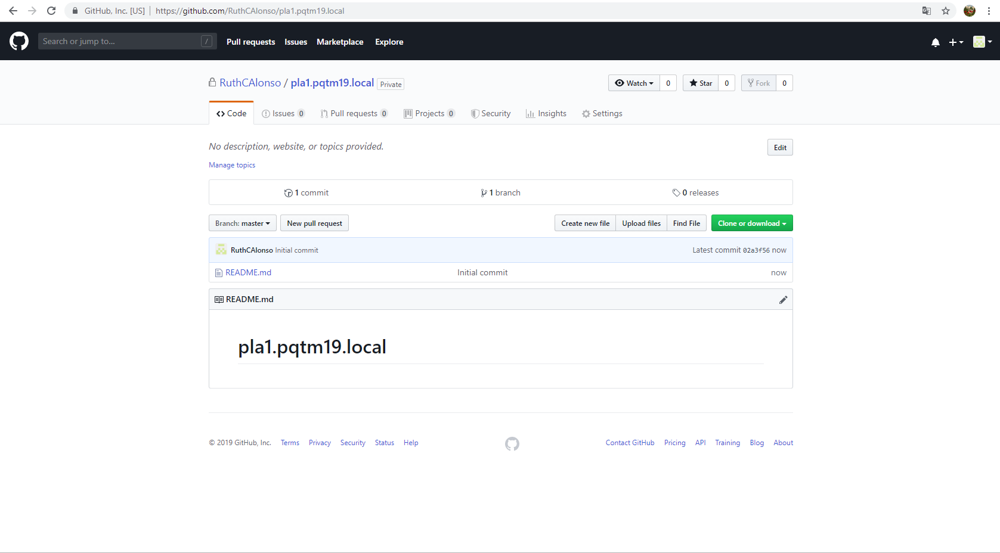

## 8. Exportación de la rama "máster" local sobre el repositorio GitHub
Copiamos la URI del repositorio creado en GitHub. En Eclipse, entramos en la perspectiva Git: window> perspective > Git
En el menú de la izquierda, abrimos el menú contextual del repositorio pla1.pqtm19.local y seleccionamos push branch master>preview>
When pulling:merge. Si hacemos el archivo README.md en Eclipse, forzamos la sobreescritura seleccionando force overwrite. Si no, lo hacemos en GitHub y posteriormente hacemos un commit new file. Para pasarlo de aquí GitHub a Eclipse: clic derecho en pla1.pqtm19.local[master]-C:\PQTM19\Projectes\pla1.pqtm19.local\.git
